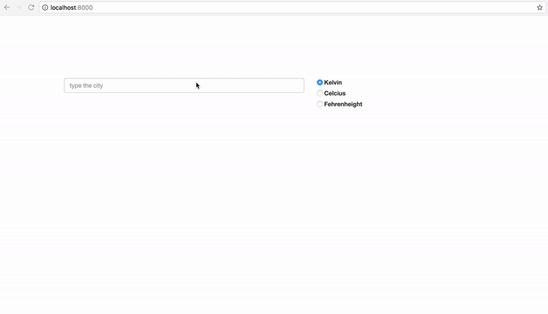

# PYP / Day - 21

Table of Contents :

1. [Prerequisites](#prerequisites)
1. [Lessons topics](#lessons-topics)  
1. [Assigment](#assigment)
1. [Resources](#resources)

---
## Prerequisites

Measures to take before starting

* Install [VS Code](https://code.visualstudio.com/download) on your local machine
* Setup [Github Desktop](https://desktop.github.com/) on your local machine

---

## Lessons topics:

* React Testing
    * What is testing? Why we test?
    * Types of testing
    * Jest

---

## Assigment:

Build a React App that shows current weather in given cities with different temperature units. You can see a demo of working result below:

Note: Get the data from [Open Weather Map](http://openweathermap.org) via API. You can find a API key in [`./api.text`](./api.text)

Design and behavior:

* User types city name into the box
* When the user hits enter, city name and temperature appears in the list below, with the active temperature unit
* When user changes temperature unit, list updates consequently
* User can remove any of the city from the list by clicking the "minus" icon in front of the city name

### Must have:

* write unit tests using `jest.`
* during unit testing, make sure the app's initial render works as intended
* tests must cover every state changes (adding/removing city, temperature unit changes)
* make sure you're mocking async calls

---

## Resources:

* To read:

    - [Testing Overview – React](https://reactjs.org/docs/testing.html)
    - [Guide to testing React Hooks](https://blog.logrocket.com/a-quick-guide-to-testing-react-hooks-fa584c415407/)
    - [A Practical Guide To Testing React Applications With Jest — Smashing Magazine](https://www.smashingmagazine.com/2020/06/practical-guide-testing-react-applications-jest/)

* To watch:

    - [React unit testing with Jest & React-testing-library](https://youtu.be/3e1GHCA3GP0)
    - [Intro to React Testing](https://youtu.be/ZmVBCpefQe8)

